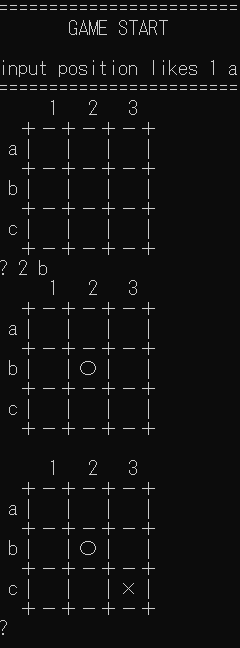

# 課題：強くして
本リポジトリのAIに対して、何らかの工夫をしてください！

* 計算を効率化する
* 新たなアルゴリズムを実装する

5目並べにすると、わかりやすいかもしれません。

# 取り組み方
* 本プロジェクトをforkして、取り組んでください。
  * こちらで、プロジェクトを見に行くので、プルリクなどは不要です。
* readme.md に実施した工夫を記載してください
* 可能であれば、速度等を計測して、具体的な効率化度合い、強さを示してください。

# 〆切
6/7(日)
